# Alkemy GSlide Fullstack Architecture Document

## Introduction

This document outlines the complete fullstack architecture for Alkemy GSlide, including backend systems, frontend implementation, and their integration. It serves as the single source of truth for AI-driven development, ensuring consistency across the entire technology stack.

This unified approach combines what would traditionally be separate backend and frontend architecture documents, streamlining the development process for modern fullstack applications where these concerns are increasingly intertwined.

### Starter Template or Existing Project

**Decision: N/A - Greenfield project** with clear technology direction already established in PRD.

After reviewing the PRD requirements, this appears to be a greenfield project with specific technology preferences indicated:
- **Next.js** explicitly mentioned for rapid iteration
- **Tailwind CSS** specified for modern UI styling  
- **Client-side processing** requirement (no backend authentication needed)
- **Split-screen UI** with real-time preview capabilities

### Change Log
| Date | Version | Description | Author |
|------|---------|-------------|--------|
| 2025-09-02 | v1.0 | Initial Architecture Creation | Winston (Architect Agent) |

## High Level Architecture

### Technical Summary
Alkemy GSlide is a **client-side only React application** built with Next.js and shadcn/ui components. The application provides a modern, split-screen interface for visual Google Slides batchUpdate configuration without any backend dependencies. All processing occurs in the browser, with file operations handled through native browser APIs for import/export functionality.

### Platform and Infrastructure Choice
**Platform:** Vercel (Static Site Generation/Client-Side)  
**Key Services:** Vercel hosting, CDN distribution  
**Deployment Host and Regions:** Global CDN via Vercel Edge Network

### Repository Structure
**Structure:** Single repository, frontend-only  
**Monorepo Tool:** N/A - Single Next.js application  
**Package Organization:** Standard Next.js app structure with organized components

### High Level Architecture Diagram

```mermaid
graph TB
    User[👤 User] --> Browser[🌐 Browser]
    Browser --> App[⚛️ Next.js App]
    App --> UI[🎨 shadcn/ui Components]
    App --> Preview[👁️ Real-time Preview]
    App --> FileOps[📁 File Operations]
    FileOps --> Export[💾 Export JSON/MD]
    FileOps --> Import[📂 Import JSON]
    Preview --> Renderer[🖼️ Slides Renderer]
    
    subgraph "Client-Side Only"
        App
        UI
        Preview
        FileOps
        Renderer
    end
    
    subgraph "Deployment"
        Vercel[☁️ Vercel CDN]
    end
    
    App --> Vercel
```



### Architectural Patterns
- **Static Site Generation (SSG):** Pre-built React application served from CDN - _Rationale:_ Maximum performance and no server costs for client-side app
- **Component-Based UI:** Reusable shadcn/ui components with TypeScript - _Rationale:_ Modern, accessible, and consistent design system
- **Client-Side State Management:** React state with Context API - _Rationale:_ Simple state needs, no complex server synchronization required
- **File System API Integration:** Browser-native file operations - _Rationale:_ No backend needed for save/load functionality

## Tech Stack

| Category | Technology | Version | Purpose | Rationale |
|----------|------------|---------|---------|-----------|
| **Runtime & Package Manager** | **Bun** | **1.x** | **JS runtime and package manager** | **Ultra-fast installs, native TypeScript, built-in bundler** |
| Frontend Language | TypeScript | 5.x | Type safety for complex JSON structures | Critical for batchUpdate JSON validation and IDE support |
| Frontend Framework | Next.js | 14.x | React framework with SSG | Perfect for client-side apps with excellent DX |
| UI Component Library | shadcn/ui | Latest | Modern, accessible components | Requested modern look with excellent customization |
| CSS Framework | Tailwind CSS | 3.x | Utility-first styling | Specified in PRD, works perfectly with shadcn/ui |
| State Management | Zustand | 4.x | Lightweight state for batchUpdate JSON | Simple, TypeScript-friendly state for complex JSON objects |
| JSON Schema Validation | Zod | 3.x | Runtime validation of batchUpdate | Ensures exported JSON matches Google Slides API spec |
| File Operations | Browser File System API | Native | Import/export JSON and MD | Native browser APIs for client-side file operations |
| Frontend Testing | **Bun Test** | **Built-in** | **Fast native testing** | **Bun's built-in test runner - faster than Vitest** |
| E2E Testing | Playwright | Latest | End-to-end testing | Test complete import/export workflows |
| Build Tool | **Bun** | **Built-in** | **Fast development builds** | **Native bundling and dev server** |
| Bundler | **Bun Bundler** | **Built-in** | **Ultra-fast bundling** | **Faster than Webpack/Vite for development** |
| Deployment | Vercel | Latest | Static site hosting | Perfect for Next.js, global CDN |
| Code Quality | ESLint + Prettier | Latest | Code formatting and linting | Standard TypeScript development |

## Data Models

### Core Data Model: Google Slides batchUpdate Array

**Purpose:** The singular source of truth for all slide configuration data. Every UI interaction maps directly to valid batchUpdate request objects.

**Key Architecture Principles:**
- **batchUpdate Array:** `Array<BatchUpdateRequest>` - The complete state of the application
- **No Internal Models:** UI components read/write directly to valid Google Slides API structures  
- **Immutable Updates:** State changes produce new valid batchUpdate arrays
- **Validation-First:** All changes validated against Google Slides API schema before commit

```typescript
// Primary Application State
interface AppState {
  batchUpdateRequests: BatchUpdateRequest[];
  currentSlideId?: string;
  validationErrors: ValidationError[];
  isExportBlocked: boolean;
}

// Google Slides API Request Types (exact API compliance)
type BatchUpdateRequest = 
  | CreateSlideRequest
  | CreateShapeRequest
  | CreateTextBoxRequest
  | CreateImageRequest
  | UpdateShapePropertiesRequest
  | UpdateTextStyleRequest
  | UpdateImagePropertiesRequest
  | DeleteObjectRequest;

interface CreateShapeRequest {
  createShape: {
    objectId: string;
    shapeType: 'RECTANGLE' | 'ELLIPSE' | 'ROUND_RECTANGLE' | 'TEXT_BOX' | 'CLOUD' | 'CUSTOM';
    elementProperties: {
      pageObjectId: string;
      size: {
        width: { magnitude: number; unit: 'EMU' | 'PT' };
        height: { magnitude: number; unit: 'EMU' | 'PT' };
      };
      transform: {
        scaleX: number;
        scaleY: number;
        translateX: number;
        translateY: number;
        unit: 'EMU' | 'PT';
      };
    };
  };
}
```

## API Specification

Since this is a **frontend-only application**, there are no traditional REST/GraphQL APIs. However, the application has critical **internal APIs** for managing the batchUpdate JSON data structure.

### Internal Data APIs

```typescript
// Core batchUpdate Management API
interface BatchUpdateAPI {
  // State Management
  getBatchUpdateArray(): BatchUpdateRequest[];
  setBatchUpdateArray(requests: BatchUpdateRequest[]): Promise<ValidationResult>;
  
  // Element Creation APIs
  createShape(params: CreateShapeParams): Promise<string>; // Returns objectId
  createTextBox(params: CreateTextBoxParams): Promise<string>;
  createImage(params: CreateImageParams): Promise<string>;
  
  // Element Update APIs  
  updateShapeProperties(objectId: string, properties: ShapeProperties): Promise<void>;
  updateTextStyle(objectId: string, style: TextStyle): Promise<void>;
  updateElementTransform(objectId: string, transform: AffineTransform): Promise<void>;
  
  // Element Deletion
  deleteElement(objectId: string): Promise<void>;
  
  // Validation
  validateBatchUpdate(): ValidationResult;
  
  // Import/Export
  importFromJSON(json: BatchUpdateRequest[]): Promise<ValidationResult>;
  exportToJSON(): BatchUpdateRequest[];
  exportToMarkdown(filename: string): string;
}
```

## Components

### SplitScreenLayout
**Responsibility:** Root layout component implementing the core split-screen interface specified in PRD requirements.

**Key Interfaces:**
- Manages responsive layout between editor panel and preview panel
- Handles panel resizing and responsive breakpoints
- Provides global keyboard shortcuts and drag-and-drop zones

**Dependencies:** None (root component)

**Technology Stack:** Next.js App Router layout, shadcn/ui ResizablePanels, Tailwind responsive utilities

### BatchUpdateEditor 
**Responsibility:** Left panel component for visual editing of batchUpdate JSON structure.

**Key Interfaces:**
- `onBatchUpdateChange(requests: BatchUpdateRequest[])` - Emits changes to parent
- `batchUpdateRequests: BatchUpdateRequest[]` - Receives current state
- `validationErrors: ValidationError[]` - Displays validation feedback

**Dependencies:** BatchUpdateAPI, ValidationAPI, ElementInspector components

**Technology Stack:** shadcn/ui forms, Zod validation, Zustand state management

### SlidePreviewRenderer
**Responsibility:** Right panel component that visually simulates Google Slides output using only batchUpdate JSON data.

**Key Interfaces:**
- `batchUpdateRequests: BatchUpdateRequest[]` - Renders visual simulation
- `selectedElementId?: string` - Highlights selected element
- `onElementSelect(objectId: string)` - Element selection callback

**Dependencies:** RenderEngine, ElementRenderer components

**Technology Stack:** React rendering, CSS transforms matching Google Slides coordinate system, HTML5 Canvas for complex shapes

### Component Architecture Diagram

```mermaid
graph TB
    App[🏠 Next.js App] --> Layout[📱 SplitScreenLayout]
    
    Layout --> Editor[✏️ BatchUpdateEditor]
    Layout --> Preview[👁️ SlidePreviewRenderer]
    
    Editor --> Inspector[🔍 ElementInspector]
    Editor --> FileOps[📁 FileOperationsManager]
    Editor --> Validation[✅ ValidationManager]
    
    Preview --> RenderEngine[🎨 RenderEngine]
    RenderEngine --> ElementRenderer[🔲 ElementRenderer Components]
    
    subgraph "State Management"
        Zustand[🗃️ Zustand Store]
        BatchAPI[📡 BatchUpdate API]
    end
    
    Editor --> Zustand
    Preview --> Zustand
    Zustand --> BatchAPI
    
    subgraph "Validation Layer"
        Validation --> ZodSchemas[📋 Zod Schemas]
        ZodSchemas --> GoogleAPI[🔗 Google Slides Types]
    end
```



## Core Workflows

### Element Creation Workflow


## Database Schema

Since this is a **client-side only application**, there is no traditional database. However, the application requires persistent storage schemas for local data management.

### Browser Storage Schema

**LocalStorage Schema for User Preferences:**
```typescript
// localStorage key: "alkemy-gslide-preferences"
interface UserPreferences {
  version: "1.0";
  lastModified: string; // ISO timestamp
  ui: {
    panelSplit: number; // 0.0 to 1.0, editor panel width ratio
    theme: "light" | "dark" | "system";
    gridSnap: boolean;
    showRuler: boolean;
    defaultUnits: "PT" | "EMU";
  };
  export: {
    defaultFilename: string;
    includeMetadata: boolean;
    prettyPrintJSON: boolean;
  };
}
```

**SessionStorage Schema for Working State:**
```typescript
// sessionStorage key: "alkemy-gslide-session" 
interface WorkingSession {
  version: "1.0";
  sessionId: string;
  lastSaved: string; // ISO timestamp
  autoSaveEnabled: boolean;
  
  // Current working state
  batchUpdateRequests: BatchUpdateRequest[]; // The canonical data
  selectedElementId?: string;
  undoStack: BatchUpdateRequest[][]; // Previous states for undo
  redoStack: BatchUpdateRequest[][]; // Future states for redo
  
  // Validation cache
  lastValidationResult: ValidationResult;
  validationTimestamp: string;
}
```

## Frontend Architecture

### Component Architecture

**Component Organization:**
```
src/
├── components/
│   ├── ui/                     # shadcn/ui components
│   │   ├── button.tsx
│   │   ├── input.tsx
│   │   ├── dialog.tsx
│   │   └── resizable.tsx
│   ├── editor/                 # Left panel components
│   │   ├── BatchUpdateEditor.tsx
│   │   ├── ElementInspector.tsx
│   │   ├── ElementToolbar.tsx
│   │   └── PropertyPanels/
│   │       ├── ShapeProperties.tsx
│   │       ├── TextProperties.tsx
│   │       └── TransformProperties.tsx
│   ├── preview/                # Right panel components
│   │   ├── SlidePreviewRenderer.tsx
│   │   ├── ElementRenderer.tsx
│   │   ├── CoordinateSystem.tsx
│   │   └── SelectionOverlay.tsx
│   ├── file-operations/        # Import/Export components
│   │   ├── FileOperationsManager.tsx
│   │   ├── ImportDialog.tsx
│   │   ├── ExportDialog.tsx
│   │   └── ValidationErrorList.tsx
│   └── layout/                 # Layout components
│       ├── SplitScreenLayout.tsx
│       ├── Header.tsx
│       └── StatusBar.tsx
```

### State Management Architecture

**Zustand Store Schema:**
```typescript
interface AppState {
  // Core Data (canonical source of truth)
  batchUpdateRequests: BatchUpdateRequest[];
  
  // UI State
  selectedElementId?: string;
  activePanel: "editor" | "preview";
  isDirty: boolean; // Has unsaved changes
  
  // Validation State
  validationResult: ValidationResult;
  isExportBlocked: boolean;
  
  // History Management
  undoStack: BatchUpdateRequest[][];
  redoStack: BatchUpdateRequest[][];
  canUndo: boolean;
  canRedo: boolean;
  
  // Actions
  setBatchUpdateArray: (requests: BatchUpdateRequest[]) => Promise<void>;
  addBatchUpdateRequest: (request: BatchUpdateRequest) => Promise<void>;
  updateBatchUpdateRequest: (index: number, request: BatchUpdateRequest) => Promise<void>;
  removeBatchUpdateRequest: (index: number) => Promise<void>;
}
```

## Unified Project Structure

```plaintext
alkemy-gslide/
├── .github/                    # CI/CD workflows
│   └── workflows/
│       ├── ci.yml              # Build, test, lint on PR
│       └── deploy.yml          # Deploy to Vercel on main
├── public/                     # Static assets
│   ├── icons/                  # App icons and favicons
│   ├── images/                 # Static images
│   └── manifest.json           # PWA manifest
├── src/                        # Application source code
│   ├── app/                    # Next.js App Router
│   │   ├── globals.css         # Global Tailwind styles
│   │   ├── layout.tsx          # Root layout with providers
│   │   ├── page.tsx            # Main editor page (/)
│   │   ├── import/
│   │   │   └── page.tsx        # Import workflow page
│   │   └── export/
│   │       └── page.tsx        # Export workflow page
│   ├── components/             # React components
│   │   ├── ui/                 # shadcn/ui components
│   │   ├── editor/             # Left panel editor components
│   │   ├── preview/            # Right panel preview components
│   │   ├── file-operations/    # Import/Export components
│   │   └── layout/             # Layout components
│   ├── lib/                    # Utility libraries and configurations
│   │   ├── utils.ts            # General utility functions
│   │   ├── cn.ts               # Class name utility (clsx + tailwind-merge)
│   │   ├── constants.ts        # App constants
│   │   └── validations/        # Zod validation schemas
│   ├── services/               # Business logic and external API wrappers
│   │   ├── batchUpdateService.ts    # Core batchUpdate operations
│   │   ├── fileSystemService.ts     # File import/export operations
│   │   ├── validationService.ts     # Validation logic
│   │   └── renderingService.ts      # Preview rendering logic
│   ├── stores/                 # Zustand state management
│   │   ├── batchUpdateStore.ts # Main application state
│   │   ├── uiStore.ts          # UI preferences and state
│   │   └── index.ts            # Store exports
│   ├── types/                  # TypeScript type definitions
│   │   ├── googleSlides.ts     # Google Slides API types
│   │   ├── app.ts              # Application-specific types
│   │   └── index.ts            # Type exports
│   └── hooks/                  # Custom React hooks
│       ├── useBatchUpdate.ts   # batchUpdate management hook
│       ├── useFileOperations.ts # File operations hook
│       └── useValidation.ts    # Validation hook
├── tests/                      # Test files
├── docs/                       # Project documentation
│   ├── prd.md                  # Product Requirements Document
│   └── architecture.md         # This architecture document
├── bun.lockb                   # Bun lockfile
├── bunfig.toml                 # Bun configuration
├── components.json             # shadcn/ui configuration
├── next.config.js              # Next.js configuration
├── package.json                # Node.js dependencies and scripts
├── tailwind.config.ts          # Tailwind CSS configuration
└── tsconfig.json               # TypeScript configuration
```

## Development Workflow

### Local Development Setup

**Prerequisites:**
```bash
# Install Bun (latest version)
curl -fsSL https://bun.sh/install | bash

# Verify installation
bun --version
```

**Initial Setup:**
```bash
# Clone the repository
git clone https://github.com/your-org/alkemy-gslide.git
cd alkemy-gslide

# Install dependencies with Bun
bun install

# Copy environment template
cp .env.example .env.local

# Run initial build to verify setup
bun run build
```

**Development Commands:**
```bash
# Start development server with Turbo mode
bun dev

# Build for production
bun run build

# Type checking
bun run type-check

# Lint code
bun run lint

# Run unit tests
bun test

# Run E2E tests
bun test:e2e
```

### Environment Configuration

**Required Environment Variables:**

**Frontend (.env.local):**
```bash
# App Configuration
NEXT_PUBLIC_APP_NAME="Alkemy GSlide"
NEXT_PUBLIC_APP_VERSION="1.0.0"

# Development Settings
NEXT_PUBLIC_DEBUG_MODE="true"
NEXT_PUBLIC_VALIDATION_STRICT="true"

# Feature Flags
NEXT_PUBLIC_ENABLE_AUTOSAVE="true"
NEXT_PUBLIC_ENABLE_MARKDOWN_EXPORT="true"
NEXT_PUBLIC_ENABLE_KEYBOARD_SHORTCUTS="true"
```

## Deployment Architecture

### Deployment Strategy

**Frontend Deployment:**
- **Platform:** Vercel (optimized for Next.js static export)
- **Build Command:** `bun run build`
- **Output Directory:** `out/` (Next.js static export)
- **CDN/Edge:** Vercel Edge Network with global distribution

### CI/CD Pipeline

**GitHub Actions Configuration (.github/workflows/ci.yml):**
```yaml
name: CI/CD Pipeline

on:
  push:
    branches: [main, develop]
  pull_request:
    branches: [main]

jobs:
  quality-checks:
    runs-on: ubuntu-latest
    steps:
      - name: Checkout code
        uses: actions/checkout@v4

      - name: Setup Bun
        uses: oven-sh/setup-bun@v1
        with:
          bun-version: latest

      - name: Install dependencies
        run: bun install --frozen-lockfile

      - name: Type check
        run: bun run type-check

      - name: Lint
        run: bun run lint

      - name: Unit tests
        run: bun test --coverage

      - name: Build application
        run: bun run build

      - name: E2E tests
        run: bun test:e2e
```

### Environments

| Environment | Frontend URL | Purpose | Auto-Deploy |
|-------------|-------------|---------|-------------|
| Development | http://localhost:3000 | Local development | No |
| Preview | https://alkemy-gslide-git-[branch].vercel.app | Feature branch testing | Yes (on PR) |
| Staging | https://staging.alkemy-gslide.com | Pre-production testing | Yes (on develop) |
| Production | https://alkemy-gslide.com | Live environment | Yes (on main) |

## Security and Performance

### Security Requirements

**Frontend Security:**
- **CSP Headers:** `"default-src 'self'; script-src 'self' 'unsafe-eval'; style-src 'self' 'unsafe-inline'; img-src 'self' data: blob:; connect-src 'self'"`
- **XSS Prevention:** React's built-in XSS protection + input sanitization for user-generated content
- **Secure Storage:** SessionStorage for temporary data, IndexedDB for persistent data, no sensitive data stored client-side

**Authentication Security:**
- **Token Storage:** N/A - No authentication required per PRD
- **Session Management:** Browser session only, no server sessions
- **Password Policy:** N/A - No user accounts

### Performance Optimization

**Frontend Performance:**
- **Bundle Size Target:** < 500KB gzipped main bundle
- **Loading Strategy:** Code splitting by route and feature
- **Caching Strategy:** Browser caching + Service Worker for static assets

**Performance Targets:**
- **First Contentful Paint:** < 1.5s
- **Largest Contentful Paint:** < 2.5s
- **Cumulative Layout Shift:** < 0.1
- **First Input Delay:** < 100ms
- **Total Blocking Time:** < 200ms

## Testing Strategy

### Testing Pyramid

```
        E2E Tests (Playwright)
       /                    \
    Integration Tests (Bun Test)
   /                            \
Unit Tests (Bun Test)    Component Tests (RTL)
```

### Test Organization

**Frontend Tests:**
```
tests/
├── unit/                      # Unit tests for pure functions
│   ├── services/
│   ├── utils/
│   └── stores/
├── components/                # Component tests
│   ├── editor/
│   ├── preview/
│   └── file-operations/
├── integration/               # Integration tests
│   ├── workflows/
│   └── stores/
└── e2e/                      # End-to-end tests
    ├── specs/
    ├── fixtures/
    └── utils/
```

## Coding Standards

### Critical Frontend Rules

- **batchUpdate JSON Integrity:** All UI operations must produce valid Google Slides API requests - never compromise JSON structure for UI convenience
- **Validation-First Development:** Every state change must pass validation before committing - invalid states are not allowed to persist
- **Type Safety:** All batchUpdate operations must use strict TypeScript types - no `any` types in JSON manipulation code
- **Immutable State Updates:** Never mutate batchUpdate arrays directly - always create new arrays/objects for state changes
- **Export Contract:** Exported JSON must be copy-pasteable into Google Slides API calls without modification
- **Component Data Flow:** Components receive batchUpdate data as props, emit changes via callbacks - no direct store access in components
- **Error Boundary:** All validation errors must be caught and displayed to users with actionable feedback
- **File Operations Safety:** All file imports must be validated before applying to state - malformed files cannot corrupt application state

### Naming Conventions

| Element | Convention | Example |
|---------|------------|---------|
| Components | PascalCase | `BatchUpdateEditor.tsx` |
| Hooks | camelCase with 'use' | `useBatchUpdate.ts` |
| Services | PascalCase + Service | `ValidationService.ts` |
| Types | PascalCase | `BatchUpdateRequest` |
| Constants | SCREAMING_SNAKE_CASE | `MAX_OBJECT_ID_LENGTH` |
| Files | kebab-case or PascalCase | `batch-update-store.ts` or `ElementRenderer.tsx` |

## Error Handling Strategy

### Error Flow


### Error Response Format

```typescript
interface ApiError {
  error: {
    code: string;           // Machine-readable error code
    message: string;        // Human-readable message
    details?: Record<string, any>; // Additional context
    timestamp: string;      // ISO timestamp
    requestId: string;      // Unique identifier for tracking
    path?: string;          // JSON path to invalid property
    suggestion?: string;    // How to fix the error
  };
}
```

## Monitoring and Observability

### Monitoring Stack

- **Frontend Monitoring:** Browser Performance API + Web Vitals + Custom metrics
- **Error Tracking:** Client-side error collection with structured reporting
- **Performance Monitoring:** Real User Monitoring (RUM) for Core Web Vitals
- **Usage Analytics:** Privacy-focused usage tracking for feature adoption

### Key Metrics

**Frontend Metrics:**
- **Core Web Vitals:** First Contentful Paint, Largest Contentful Paint, Cumulative Layout Shift, First Input Delay
- **JavaScript Errors:** Runtime errors, validation failures, file operation failures
- **API Response Times:** File system operations, validation processing time
- **User Interactions:** Element creation, property modifications, import/export usage

**Application-Specific Metrics:**
- **batchUpdate Complexity:** Number of requests per project, validation time
- **File Operation Performance:** Import/export success rates, file sizes processed
- **Validation Metrics:** Error rates by validation rule, most common validation failures
- **User Journey Metrics:** Time to first element creation, export completion rates

---

*This architecture document serves as the definitive guide for developing Alkemy GSlide with a focus on batchUpdate JSON integrity, validation-first development, and seamless Google Slides API compatibility.*