# Components

## SplitScreenLayout
**Responsibility:** Root layout component implementing the core split-screen interface specified in PRD requirements.

**Key Interfaces:**
- Manages responsive layout between editor panel and preview panel
- Handles panel resizing and responsive breakpoints
- Provides global keyboard shortcuts and drag-and-drop zones

**Dependencies:** None (root component)

**Technology Stack:** Next.js App Router layout, shadcn/ui ResizablePanels, Tailwind responsive utilities

## BatchUpdateEditor 
**Responsibility:** Left panel component for visual editing of batchUpdate JSON structure.

**Key Interfaces:**
- `onBatchUpdateChange(requests: BatchUpdateRequest[])` - Emits changes to parent
- `batchUpdateRequests: BatchUpdateRequest[]` - Receives current state
- `validationErrors: ValidationError[]` - Displays validation feedback

**Dependencies:** BatchUpdateAPI, ValidationAPI, ElementInspector components

**Technology Stack:** shadcn/ui forms, Zod validation, Zustand state management

## SlidePreviewRenderer
**Responsibility:** Right panel component that visually simulates Google Slides output using only batchUpdate JSON data.

**Key Interfaces:**
- `batchUpdateRequests: BatchUpdateRequest[]` - Renders visual simulation
- `selectedElementId?: string` - Highlights selected element
- `onElementSelect(objectId: string)` - Element selection callback

**Dependencies:** RenderEngine, ElementRenderer components

**Technology Stack:** React rendering, CSS transforms matching Google Slides coordinate system, HTML5 Canvas for complex shapes

## Component Architecture Diagram

```mermaid
graph TB
    App[🏠 Next.js App] --> Layout[📱 SplitScreenLayout]
    
    Layout --> Editor[✏️ BatchUpdateEditor]
    Layout --> Preview[👁️ SlidePreviewRenderer]
    
    Editor --> Inspector[🔍 ElementInspector]
    Editor --> FileOps[📁 FileOperationsManager]
    Editor --> Validation[✅ ValidationManager]
    
    Preview --> RenderEngine[🎨 RenderEngine]
    RenderEngine --> ElementRenderer[🔲 ElementRenderer Components]
    
    subgraph "State Management"
        Zustand[🗃️ Zustand Store]
        BatchAPI[📡 BatchUpdate API]
    end
    
    Editor --> Zustand
    Preview --> Zustand
    Zustand --> BatchAPI
    
    subgraph "Validation Layer"
        Validation --> ZodSchemas[📋 Zod Schemas]
        ZodSchemas --> GoogleAPI[🔗 Google Slides Types]
    end
```

