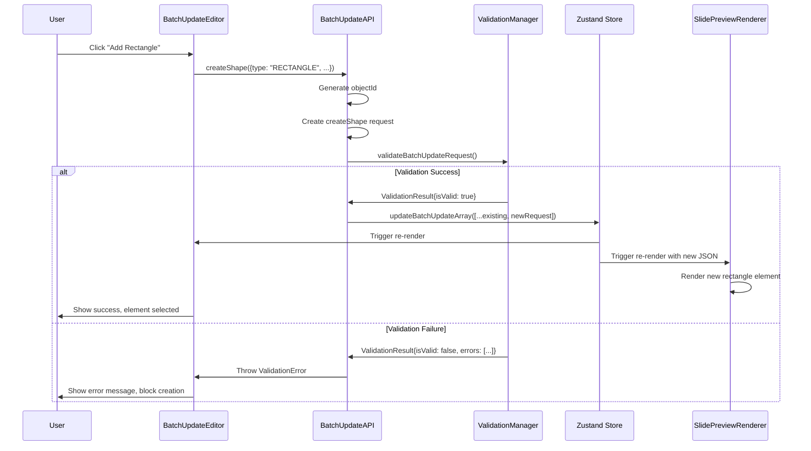

# Core Workflows

## Element Creation Workflow

```mermaid
sequenceDiagram
    participant User
    participant Editor as BatchUpdateEditor
    participant API as BatchUpdateAPI
    participant Validation as ValidationManager
    participant Store as Zustand Store
    participant Preview as SlidePreviewRenderer

    User->>Editor: Click "Add Rectangle"
    Editor->>API: createShape({type: "RECTANGLE", ...})
    API->>API: Generate objectId
    API->>API: Create createShape request
    API->>Validation: validateBatchUpdateRequest()
    
    alt Validation Success
        Validation->>API: ValidationResult{isValid: true}
        API->>Store: updateBatchUpdateArray([...existing, newRequest])
        Store->>Editor: Trigger re-render
        Store->>Preview: Trigger re-render with new JSON
        Preview->>Preview: Render new rectangle element
        Editor->>User: Show success, element selected
    else Validation Failure
        Validation->>API: ValidationResult{isValid: false, errors: [...]}
        API->>Editor: Throw ValidationError
        Editor->>User: Show error message, block creation
    end
```
