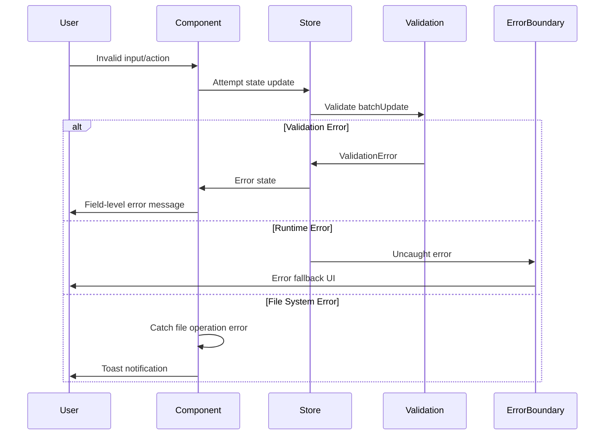

# Error Handling Strategy

## Error Flow



## Error Response Format

```typescript
interface ApiError {
  error: {
    code: string;           // Machine-readable error code
    message: string;        // Human-readable message
    details?: Record<string, any>; // Additional context
    timestamp: string;      // ISO timestamp
    requestId: string;      // Unique identifier for tracking
    path?: string;          // JSON path to invalid property
    suggestion?: string;    // How to fix the error
  };
}
```
