# High Level Architecture

## Technical Summary
Alkemy GSlide is a **client-side only React application** built with Next.js and shadcn/ui components. The application provides a modern, split-screen interface for visual Google Slides batchUpdate configuration without any backend dependencies. All processing occurs in the browser, with file operations handled through native browser APIs for import/export functionality.

## Platform and Infrastructure Choice
**Platform:** Vercel (Static Site Generation/Client-Side)  
**Key Services:** Vercel hosting, CDN distribution  
**Deployment Host and Regions:** Global CDN via Vercel Edge Network

## Repository Structure
**Structure:** Single repository, frontend-only  
**Monorepo Tool:** N/A - Single Next.js application  
**Package Organization:** Standard Next.js app structure with organized components

## High Level Architecture Diagram

```mermaid
graph TB
    User[👤 User] --> Browser[🌐 Browser]
    Browser --> App[⚛️ Next.js App]
    App --> UI[🎨 shadcn/ui Components]
    App --> Preview[👁️ Real-time Preview]
    App --> FileOps[📁 File Operations]
    FileOps --> Export[💾 Export JSON/MD]
    FileOps --> Import[📂 Import JSON]
    Preview --> Renderer[🖼️ Slides Renderer]
    
    subgraph "Client-Side Only"
        App
        UI
        Preview
        FileOps
        Renderer
    end
    
    subgraph "Deployment"
        Vercel[☁️ Vercel CDN]
    end
    
    App --> Vercel
```

## Architectural Patterns
- **Static Site Generation (SSG):** Pre-built React application served from CDN - _Rationale:_ Maximum performance and no server costs for client-side app
- **Component-Based UI:** Reusable shadcn/ui components with TypeScript - _Rationale:_ Modern, accessible, and consistent design system
- **Client-Side State Management:** React state with Context API - _Rationale:_ Simple state needs, no complex server synchronization required
- **File System API Integration:** Browser-native file operations - _Rationale:_ No backend needed for save/load functionality
