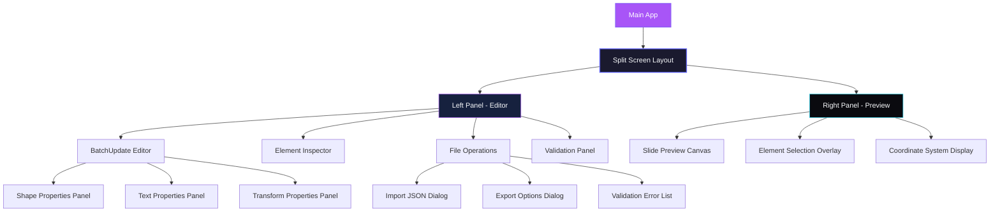
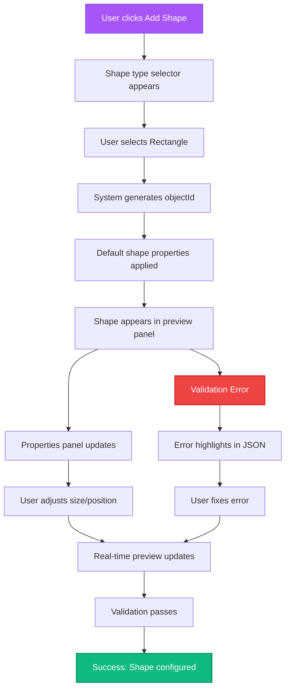
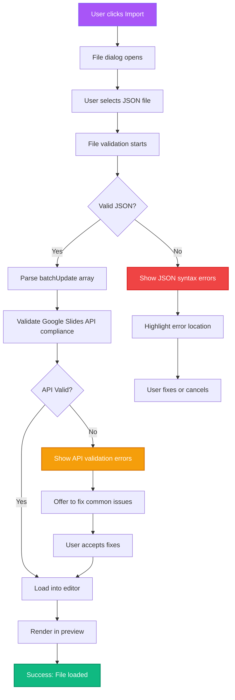
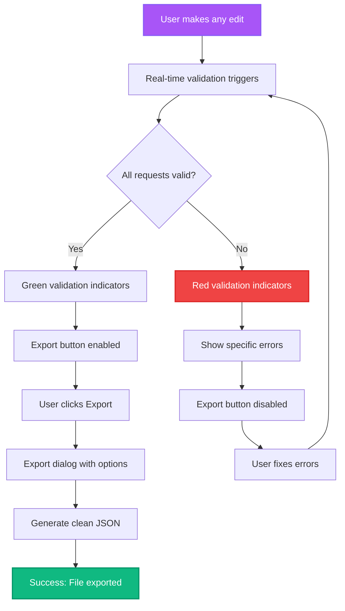

# Alkemy GSlide UI/UX Specification

## Introduction

This document defines the user experience goals, information architecture, user flows, and visual design specifications for Alkemy GSlide's user interface. It serves as the foundation for visual design and frontend development, ensuring a cohesive and user-centered experience.

### Overall UX Goals & Principles

#### Target User Personas

- **Power User:** Technical professionals who need advanced Google Slides batchUpdate configuration with visual feedback
- **Developer:** Software engineers requiring precise API request control  
- **Designer:** Creative professionals wanting visual understanding of slide configurations

#### Usability Goals

- **Immediate comprehension:** Users understand the split-screen interface within 30 seconds
- **Real-time validation:** Every JSON edit provides instant visual feedback and validation
- **Error prevention:** Dark mode with neon indicators prevents invalid API configurations
- **Efficiency:** Complex batchUpdate arrays can be built in under 5 minutes

#### Design Principles

1. **Neon Elegance** - Stunning dark UI with purple/neon accents for premium feel
2. **Validation-First** - Real-time visual indicators prevent API errors
3. **Split-Screen Mastery** - Perfect balance between JSON editor and live preview
4. **Accessible Beauty** - WCAG compliant dark mode that's gorgeous
5. **Immediate Feedback** - Every interaction has beautiful visual response

### Change Log

| Date | Version | Description | Author |
|------|---------|-------------|---------|
| 2025-09-02 | v1.0 | Initial UI/UX Specification Creation | Sally (UX Expert) |

## Information Architecture (IA)

### Site Map / Screen Inventory



### Navigation Structure

**Primary Navigation:** Header toolbar with File Operations (Import/Export), Validation Status, and Help

**Secondary Navigation:** Left panel tabs for different editing modes (Elements, Properties, Raw JSON)

**Breadcrumb Strategy:** Real-time path showing current element selection in batchUpdate array

## User Flows

### Create New Shape Element

**User Goal:** Add a new shape to the slide and configure its properties

**Entry Points:** Element toolbar, keyboard shortcut, right-click menu

**Success Criteria:** Valid createShape request added to batchUpdate array with immediate visual preview

#### Flow Diagram



#### Edge Cases & Error Handling
- Invalid objectId generation → Auto-retry with new ID
- Coordinates outside slide bounds → Snap to valid area with visual indicator
- Duplicate objectId → Show error with suggestion to regenerate
- Invalid shape type → Revert to default rectangle

### Import Existing batchUpdate JSON

**User Goal:** Load an existing batchUpdate configuration for editing

**Entry Points:** File menu, drag-drop area, keyboard shortcut

**Success Criteria:** Valid JSON loaded, parsed, and displayed in both editor and preview

#### Flow Diagram



#### Edge Cases & Error Handling
- Large files (>1MB) → Progress indicator with streaming parse
- Corrupted JSON → Show specific syntax error location
- Partial API compliance → Offer assisted fixes
- Empty file → Load with default template structure

### Real-time Validation & Export

**User Goal:** Ensure configuration is valid and export for Google Slides API use

**Entry Points:** Continuous background validation, export button

**Success Criteria:** Clean JSON exported that works directly with Google Slides API

#### Flow Diagram



#### Edge Cases & Error Handling
- Network timeout during validation → Retry with exponential backoff
- Complex validation taking >2s → Show progress indicator
- Export size >10MB → Warn user and offer compression
- Browser storage limits → Offer cloud export options

## Branding & Style Guide

### Visual Identity

**Brand Guidelines:** Modern dark mode interface with neon accents, designed for technical users who appreciate beautiful, functional design.

### Color Palette

| Color Type | Hex Code | Usage |
|------------|----------|--------|
| Background Primary | `#0a0a0f` | Main background - deep space black |
| Background Secondary | `#1a1a2e` | Panel backgrounds - darker navy |
| Background Tertiary | `#16213e` | Card backgrounds - midnight blue |
| Primary Neon | `#a855f7` | Purple primary - actions, highlights |
| Secondary Neon | `#8b5cf6` | Violet secondary - secondary actions |
| Accent Electric | `#06ffa5` | Electric green - success, validation |
| Accent Pink | `#ec4899` | Hot pink - warnings, emphasis |
| Accent Cyan | `#22d3ee` | Cyan - information, links |
| Text Primary | `#f8fafc` | Main text - almost white |
| Text Secondary | `#cbd5e1` | Secondary text - light slate |
| Text Muted | `#64748b` | Muted text - slate |
| Border Glow | `#6366f1` | Glowing borders - indigo |
| Success | `#10b981` | Validation success - emerald |
| Warning | `#f59e0b` | Important notices - amber |
| Error | `#ef4444` | Errors, validation failures - red |

### Typography

#### Font Families
- **Primary:** Inter (Clean, modern sans-serif for UI)
- **Secondary:** JetBrains Mono (Monospace for JSON/code)
- **Display:** Outfit (Modern display font for headers)

#### Type Scale

| Element | Size | Weight | Line Height |
|---------|------|---------|-------------|
| H1 | 2.5rem (40px) | 800 | 1.1 |
| H2 | 2rem (32px) | 700 | 1.2 |
| H3 | 1.5rem (24px) | 600 | 1.3 |
| Body | 0.875rem (14px) | 400 | 1.5 |
| Small | 0.75rem (12px) | 400 | 1.4 |
| Code | 0.8125rem (13px) | 400 | 1.4 |

### Iconography

**Icon Library:** Lucide React (consistent, beautiful icons with perfect dark mode compatibility)

**Usage Guidelines:** 16px/24px sizes, consistent 2px stroke width, use neon accent colors for interactive states

### Spacing & Layout

**Grid System:** 8px base unit system (8, 16, 24, 32, 48, 64, 96px)

**Spacing Scale:** Consistent spacing using Tailwind's spacing system for predictable layouts

## Component Library / Design System

### Design System Approach

Custom design system built on shadcn/ui foundation with dark mode neon aesthetic. Components feature glass-morphism effects, glowing borders, and smooth animations for a premium technical interface.

### Core Components

#### Primary Button
**Purpose:** Main actions like Export, Save, Create Element

**Variants:** Primary (neon purple), Secondary (violet), Danger (red), Success (green)

**States:** Default, Hover (glow effect), Active, Disabled, Loading

**Usage Guidelines:** 
```css
background: linear-gradient(135deg, #a855f7, #8b5cf6);
border: 1px solid #a855f7;
box-shadow: 0 0 20px rgba(168, 85, 247, 0.3);
transition: all 0.3s ease;

&:hover {
  box-shadow: 0 0 30px rgba(168, 85, 247, 0.5);
  transform: translateY(-2px);
}
```

#### Glass Panel
**Purpose:** Container for editor panels, property panels, dialogs

**Variants:** Primary, Secondary, Floating

**States:** Default, Focus, Error

**Usage Guidelines:**
```css
background: rgba(26, 26, 46, 0.8);
border: 1px solid rgba(168, 85, 247, 0.2);
backdrop-filter: blur(10px);
border-radius: 12px;
```

#### Neon Input
**Purpose:** Text inputs, JSON editor, property fields

**Variants:** Default, Code (monospace), Number, Search

**States:** Default, Focus (neon glow), Error, Disabled

**Usage Guidelines:**
```css
background: rgba(16, 33, 62, 0.6);
border: 1px solid rgba(99, 102, 241, 0.3);
color: #f8fafc;

&:focus {
  border-color: #a855f7;
  box-shadow: 0 0 0 3px rgba(168, 85, 247, 0.1);
}
```

#### Split Screen Divider
**Purpose:** Resizable divider between editor and preview panels

**Variants:** Vertical (main), Horizontal (secondary)

**States:** Default, Dragging (enhanced glow), Hover

**Usage Guidelines:** Animated neon purple line with interactive glow effects

#### Validation Badge
**Purpose:** Show real-time validation status

**Variants:** Success (green), Warning (amber), Error (red), Info (cyan)

**States:** Static, Pulsing (for active validation), Dismissed

**Usage Guidelines:** Floating badges with glow effects matching validation state

#### JSON Editor
**Purpose:** Syntax-highlighted JSON editing with dark theme

**Variants:** Full editor, Inline editor, Read-only viewer

**States:** Default, Focus, Error highlighting, Success highlighting

**Usage Guidelines:** Monaco Editor with custom dark theme and neon syntax highlighting

#### Preview Canvas
**Purpose:** Visual representation of Google Slides elements

**Variants:** Full canvas, Thumbnail, Selection overlay

**States:** Default, Element selected (neon outline), Validation error overlay

**Usage Guidelines:** Clean light background to simulate Google Slides with neon selection indicators

## Animation & Micro-interactions

### Motion Principles

- **Purposeful Motion:** Every animation serves a functional purpose (feedback, guidance, state changes)
- **Neon Fluidity:** Smooth 60fps animations with glowing effects that feel premium
- **Responsive Timing:** Fast interactions (150-300ms) for immediate feedback, slower transitions (500ms+) for context changes
- **Accessibility-First:** Respects prefers-reduced-motion and provides non-motion alternatives

### Key Animations

- **Glow Pulse:** Subtle breathing effect on primary buttons and active elements (Duration: 2s, Easing: ease-in-out)
- **Panel Slide:** Smooth panel entrance/exit with backdrop blur fade (Duration: 300ms, Easing: cubic-bezier(0.4, 0, 0.2, 1))
- **Validation Flash:** Success/error states with color washes and glow effects (Duration: 150ms, Easing: ease-out)
- **Hover Elevation:** Cards lift with enhanced glowing shadows (Duration: 200ms, Easing: ease-out)
- **Neon Border Draw:** Animated border that draws around focused elements (Duration: 400ms, Easing: ease-in-out)
- **JSON Syntax Highlight Fade:** Smooth color transitions for syntax highlighting (Duration: 100ms, Easing: linear)
- **Split Panel Resize Glow:** Enhanced glow effect during panel resizing (Duration: Continuous while dragging)
- **Element Preview Materialize:** New elements appear with scale and glow animation (Duration: 250ms, Easing: cubic-bezier(0.175, 0.885, 0.32, 1.275))

## Accessibility Requirements

### Compliance Target

**Standard:** WCAG 2.1 AA compliance with enhanced dark mode considerations

### Key Requirements

**Visual:**
- Color contrast ratios: 7:1 for text on dark backgrounds (exceeds AA requirement)
- Focus indicators: High-contrast neon outlines with 3px minimum thickness  
- Text sizing: Minimum 14px body text, scalable to 200% without horizontal scrolling

**Interaction:**
- Keyboard navigation: Full keyboard accessibility with visible focus states and neon glow indicators
- Screen reader support: Comprehensive ARIA labels, live regions for validation feedback
- Touch targets: Minimum 44px touch targets for all interactive elements

**Content:**
- Alternative text: Descriptive alt text for all preview canvas elements and icons
- Heading structure: Proper heading hierarchy with clear section organization
- Form labels: Explicit labels for all JSON editor fields and property inputs

### Testing Strategy

Automated accessibility testing with axe-core, manual testing with screen readers, and user testing with accessibility-focused participants.

## Responsiveness Strategy

### Breakpoints

| Breakpoint | Min Width | Max Width | Target Devices |
|------------|-----------|-----------|----------------|
| Mobile | 320px | 767px | Smartphones (limited functionality) |
| Tablet | 768px | 1023px | Tablets, small laptops |
| Desktop | 1024px | 1439px | Standard desktops, laptops |
| Wide | 1440px | - | Large displays, ultrawide monitors |

### Adaptation Patterns

**Layout Changes:** Mobile collapses to single panel with tab switching, Desktop maintains split-screen

**Navigation Changes:** Mobile uses bottom navigation, Desktop uses top toolbar  

**Content Priority:** Mobile prioritizes preview over editor, Desktop shows both equally

**Interaction Changes:** Mobile uses touch-friendly controls, Desktop optimizes for mouse/keyboard

## Performance Considerations

### Performance Goals

- **Page Load:** < 2 seconds first meaningful paint
- **Interaction Response:** < 100ms for all user interactions
- **Animation FPS:** Consistent 60fps for all animations

### Design Strategies

Optimized dark mode reduces battery usage on OLED displays, lazy loading for complex JSON structures, and hardware-accelerated animations using CSS transforms and opacity.
