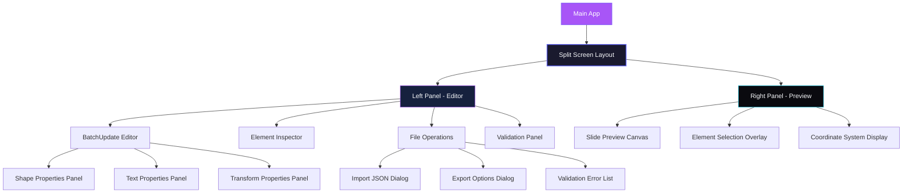

# Information Architecture (IA)

## Site Map / Screen Inventory

## Navigation Structure

**Primary Navigation:** Header toolbar with File Operations (Import/Export), Validation Status, and Help

**Secondary Navigation:** Left panel tabs for different editing modes (Elements, Properties, Raw JSON)

**Breadcrumb Strategy:** Real-time path showing current element selection in batchUpdate array
