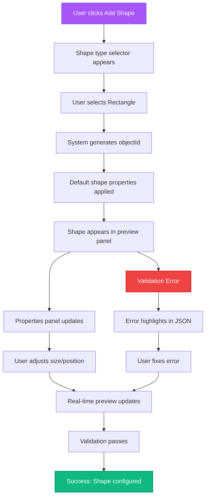
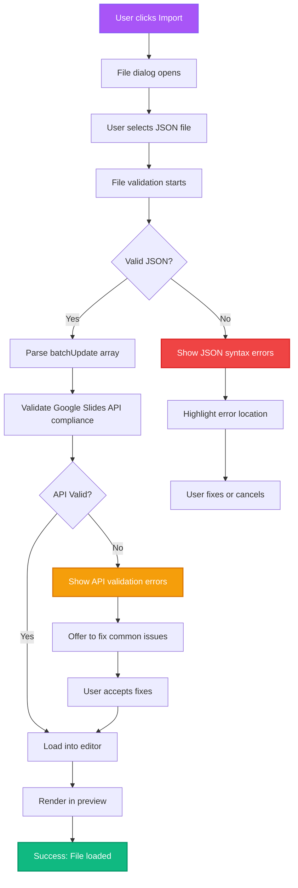
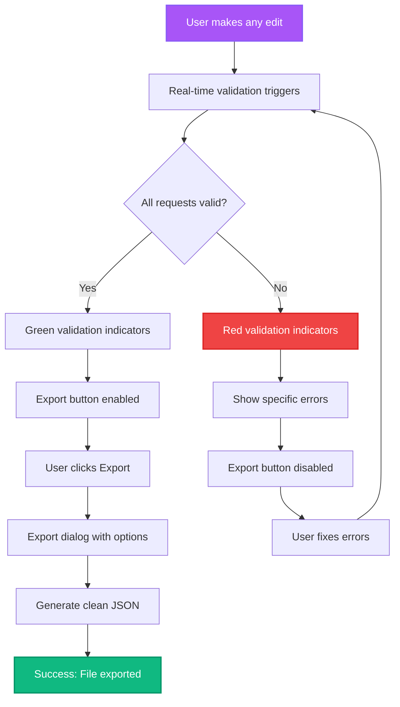

# User Flows

## Create New Shape Element

**User Goal:** Add a new shape to the slide and configure its properties

**Entry Points:** Element toolbar, keyboard shortcut, right-click menu

**Success Criteria:** Valid createShape request added to batchUpdate array with immediate visual preview

### Flow Diagram

### Edge Cases & Error Handling
- Invalid objectId generation → Auto-retry with new ID
- Coordinates outside slide bounds → Snap to valid area with visual indicator
- Duplicate objectId → Show error with suggestion to regenerate
- Invalid shape type → Revert to default rectangle

## Import Existing batchUpdate JSON

**User Goal:** Load an existing batchUpdate configuration for editing

**Entry Points:** File menu, drag-drop area, keyboard shortcut

**Success Criteria:** Valid JSON loaded, parsed, and displayed in both editor and preview

### Flow Diagram

### Edge Cases & Error Handling
- Large files (>1MB) → Progress indicator with streaming parse
- Corrupted JSON → Show specific syntax error location
- Partial API compliance → Offer assisted fixes
- Empty file → Load with default template structure

## Real-time Validation & Export

**User Goal:** Ensure configuration is valid and export for Google Slides API use

**Entry Points:** Continuous background validation, export button

**Success Criteria:** Clean JSON exported that works directly with Google Slides API

### Flow Diagram

### Edge Cases & Error Handling
- Network timeout during validation → Retry with exponential backoff
- Complex validation taking >2s → Show progress indicator
- Export size >10MB → Warn user and offer compression
- Browser storage limits → Offer cloud export options
